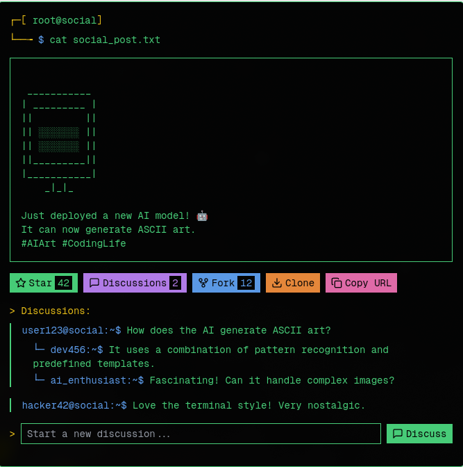

# ctrl-c
Social media platform for ~copying~ sharing code
## pages
- feed 
- search
- bookmarks (clone)

## features
- tagging cloned posts
- cloning posts to save personally 
- forking to link modified posts
- syntax highlighting in code snippets

### post anatomy

## DB
### post
| column          | type       |
|-----------------|------------|
| id              | int        |
| author          | user(id)   |
| description     | string     |
| snippet         | snippet(id)|
| stars       | int        |
| discussions | int        |
| forks       | int        |
| clones      | int        |
| fork_from (retweet)     | post(id)   |
| branch_from (quote retweet)    | snippet(id)   |
| created_at      | timestamp  |

### snippet
| column          | type       |
|-----------------|------------|
| id              | int        |
| author          | user(id)   |
| content          | string   |
| language        | string     |

### user
| column          | type       |
|-----------------|------------|
| id              | int        |
| name            | string     |
| handle          | string     |
| followers       | int        |
| following       | int        |
| description     | string     |
| created_at      | timestamp  |

### clone
| column          | type       |
|-----------------|------------|
| id              | int        |
| cloned_by       | user(id)   |
| cloned_from     | post(id)   |

### discussion
| column          | type           |
|-----------------|----------------|
| id              | int            |
| post            | post(id)       |
| author          | user(id)       |
| reply_to        | discussion(id) |
| description     | string         |
| created_at      | timestamp      |

### follow
| column          | type           |
|-----------------|----------------|
| follower        | user(id)       |
| followee        | user(id)       |

### log
| column          | type           |
|-----------------|----------------|
| id              | int            |
| type (info warning error)| string |
| message | string |
| action | string |
| created_at      | timestamp  |
